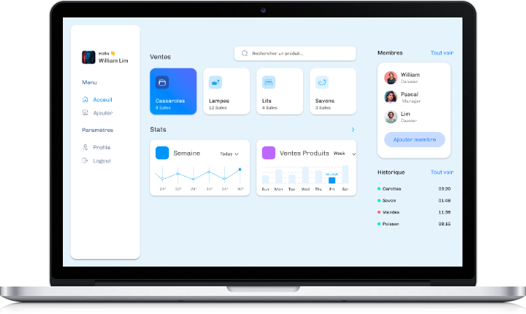

# Projet SDM x Roland



## Contexte

Le supermarché Sup2Marché, fort d' un réseau de plus de 200 enseignes en France et dans le cadre de son
expansion croissante, envisage de moderniser son système de gestion des stocks.

Ainsi, il sollicite des solutions innovantes et robustes de la part des prestataires intéressés, capables de
répondre aux besoins spécifiques d' une chaîne de distribution de cette envergure, afin d' optimiser
efficacement la gestion des stocks, les approvisionnements et les opérations logistiques à l'échelle nationale.

Le supermarché attend une solution optimisée et fonctionnelle, capable de répondre aux besoins spécificiques
d’une grande chaîne de distribution, c’est-à-dire, la gestions des stocks, les approvisionnements et les
opérations logistiques.

La solution créée sera une interface web (dashboard) permettant aux caissiers et aux managers de gérer
efficacement les stocks de leur magasin.


## Dev Team

<table>
  <tr>
    <td>William Wautrin</td>
    <td>Pascal Lim</td>
 </tr>
  <tr>
    <td>Web developer</td>
    <td>Web developer</td>
  </tr>
</table>

## Liens importants

<ul>
  <li><a href="https://mgmapp.vercel.app">Lien vers la PROD</a></li>
  <li><a href="https://www.figma.com/file/vR0FnFAauJ955LobAGbTLr/Energy-Insight-Dashboard-(Community)?type=design&node-id=0-1&mode=design&t=mabfNweEjrZgDJc5-0">Figma</a></li>
  <li><a href="https://project-william.atlassian.net/wiki/spaces/MP/pages/7929857/Conceptualisation+Merise+BDD">Confluence Documentation</a></li>
</ul>

## `.env` setup

```dotenv

# Your DB
DB_CONNECTION_HOST=
DB_CONNECTION_USER=
DB_CONNECTION_PWD=
DB_CONNECTION_DB=

# Hash password
SECURITY_PASSWORD_PEPPER=
SECURITY_JWT_SECRET=

```

## Comment installer le projet

- Clone le projet;
- Executer la commande `npm install` pour installer les dépendances;
- Configurez le fichier .env;
- Executer la commande `npx knex migrate:latest` pour creer vos tables;
- Executer la commande `npm run dev` pour lancer le site;
